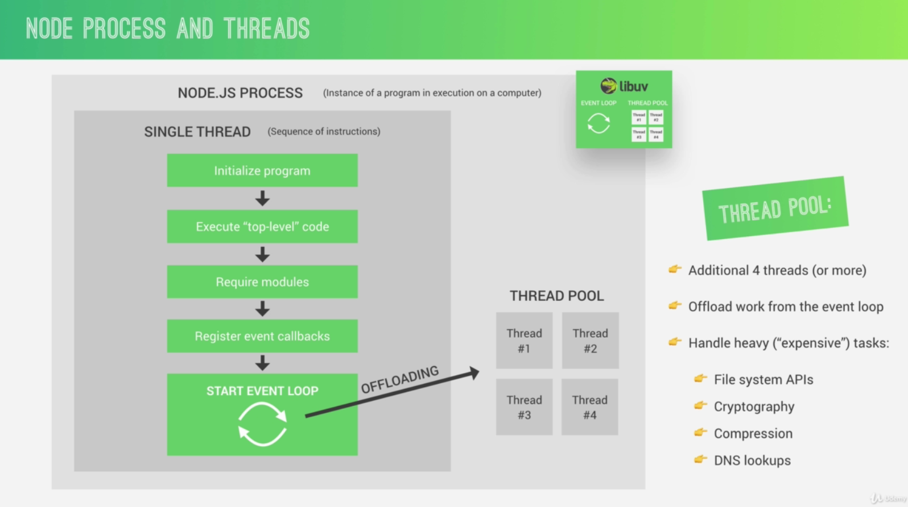
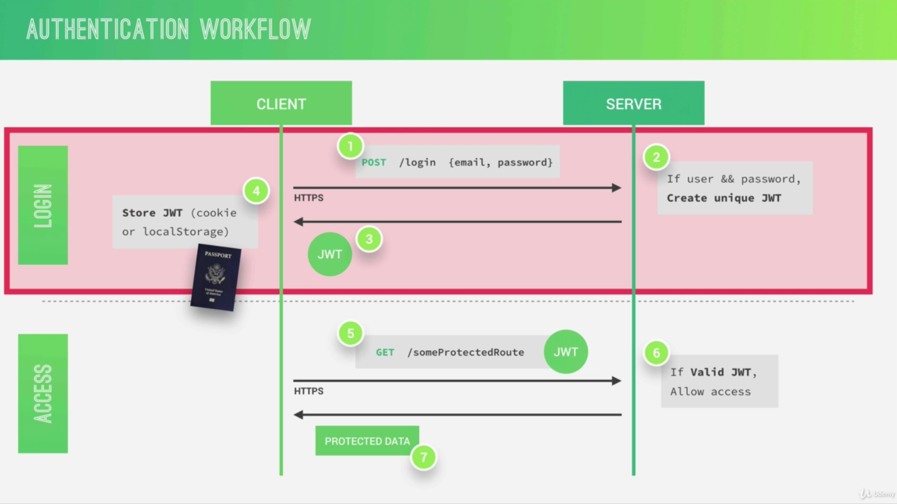
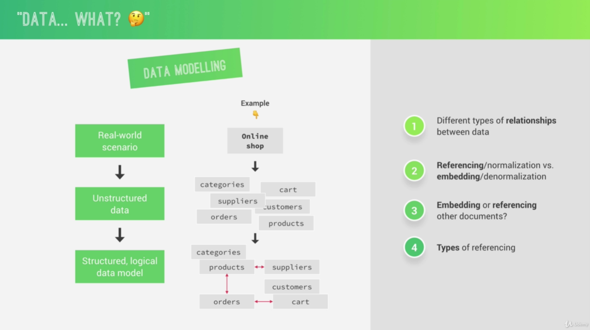
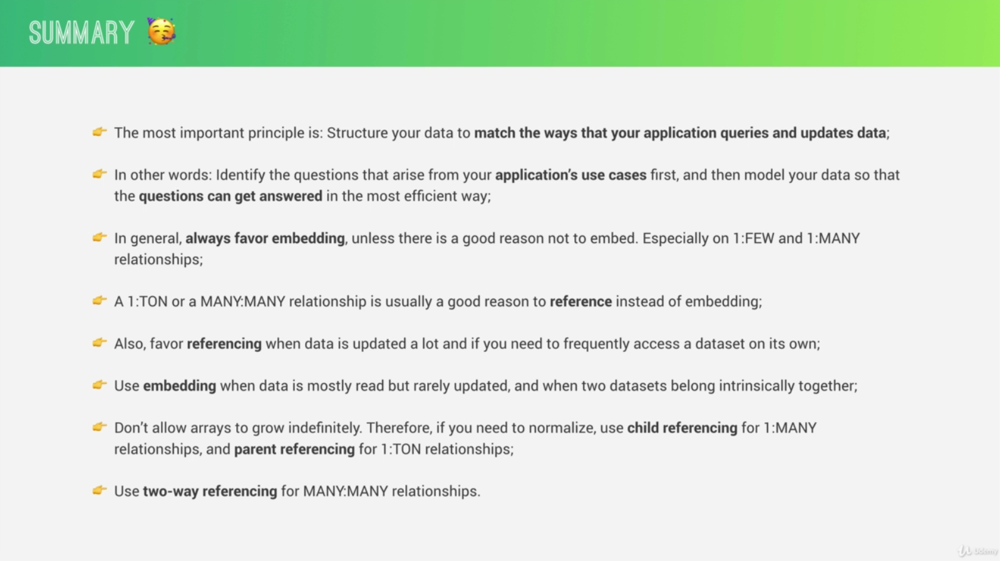

2.2 WHAT IS NODE.JS AND WHY USE IT?

NODE.JS (official definition)

NODE.JS is a JavaScript runtime built on Google's open-source V8
JavaScript engine.

NODE.JS PROPS

- Single-threaded, based on event driven, non-blocking I/O model

  - Node applications are so fast and so scalable because NodeJS is
    single threaded and based on an event driven, non-blocking I/O model
    which makes NodeJS very lightweight and efficient.

- Perfect for building fast and scalable data-intensive apps

- Companies like NETFLIX, UBER, PAYPAL, EBAY have started using node in
  production

- JavaScript across the entire stack: faster and more efficient
  development

- NPM: huge library of open-source packages available for everyone for
  free

- Very active developer community

USE NODE.JS

- API with database behind it (preferably NoSQL)

- Data streaming (think YouTube)

- Real-time chat application

- Server-side web application

DON'T USE

- Applications with heavy server-side processing (CPU-intensive)

  - This is when our app needs some super heavy server-side processing
    like heavy image manipulations, video conversion, file compression
    or anything like that. So, in this case, we're better off using
    something like Ruby on Rails, PHP, or Python.

2.6 BLOCKING AND NON-BLOCKING: ASYNCHRONOUS NATURE OF NODE.JS

Synchronous code = blocking code vs. Asynchronous code = non-blocking
code

The thread is just like a set of instructions that is run in the
computer's CPU. The thread is where our code is actually executed in a
machine's processor.

I/O simply stands for input-output, which is basically stuff like
accessing the file system and handling network requests.

2.9 ROUTING

An HTTP header is basically a piece of information about the response
that we are sending back.

There are many different standard headers that we can specify to inform
the browser or whatever client is receiving a response about the
response itself. For example, one of the standard headers is to inform
the browser of the content type.

2.18 PACKAGE VERSIONING AND UPDATING

\*: "npm update" will bump up major & minor & patch versions

\^: "npm update" will bump up minor & patch versions

\~: "npm update" will bump up patch versions

2.19 SETTING UP PRETTIER IN VS CODE

Useful VS extensions

- DotENV

- ESLint

- Image preview

- Prettier - Code formatter

- TabNine

- TODO Highlight

- Theme - Oceanic Next

- Auto Close Tag

- Auto Rename Tag

- Color Highlight

- Debugger for Chrome

- IntelliSence for CSS class names in\...

- Paste and Indent

- Path Intellisense

- Settings Sync

- Visual Studio IntelliCode - Preview

3.2 AN OVERVIEW OF HOW THE WEB WORKS

{width="7.261111111111111in"
height="3.9625in"}

<https://www.google.com/maps> (Protocol (HTTP or HTTPS) + Domain name +
Resource)

A communication protocol is simply a system of rules that allows two or
more parties to communicate.

HTTP is a protocol that allows clients and web servers to communicate by
sending requests and response messages from client to server and back.

HTTP method, there are many available but the most important ones are
GET for simply requesting data, POST for sending data, and PUT and PATCH
to basically modify data.

Request target is where the server is thought that we want to access.

Request headers are just some information that we send about the request
itself. There are tons of different headers available like what browser
is used to make the request, at what time, the user's language, and many
others.

Request body contains the data, for example, coming from an HTML form.

The main difference between HTTP and HTTPS is that HTTPS is encrypted
using TLS or SSL which are yet some more protocols.

TCP and IP are the communication protocols that define how data travels
across the web. So they are basically the Internet's fundamental control
system because they are the ones who set the rules about how data moves
on the Internet.

First, the job of TCP is to break up the requests and responses into
thousands of small chunks called packets before they are sent. Then once
they get to their destination, it will reassemble all the packets into
the original request or response so that the message arrives at the
destination as quick as possible, which would not be possible if we sent
the website simply as one big chunk. Now, as the second part, the job of
the IP protocol is to actually send and route all of these packets
through the Internet. So it ensures that all of them arrive at the
destination that they should go using IP addresses on each packet.

3.4 FRONT-END VS. BACK-END WEB DEVELOPMENT

{width="7.266666666666667in"
height="4.069444444444445in"}

3.5 STATIC VS DYNAMIC VS API

{width="7.261805555555555in"
height="4.0784722222222225in"}

{width="7.2625in"
height="4.057638888888889in"}

4.2 NODE. V8. LIBUV AND C++

{width="7.2625in"
height="4.072916666666667in"}

V8 engine is what converts JavaScript code into machine code that a
computer can actually understand.

Libuv is an open source library with a strong focus on asynchronous IO.
This layer is what gives Node access to the underlying computer
operating system, file system, networking, and more.

Besides that, libuv also implements two extremely important features of
Node.JS, which are the event loop and also the thread pool. And in
simple terms, the event loop is responsible for handling easy tasks like
executing callbacks and network IO while the thread pool is for more
heavy work like file access or compression or something like that.

Node does actually not only rely on V8 and libuv, but also on
http-parser for parsing http, c-ares or something like that for some DNS
request stuff, OpenSSL for cryptography, and also zlib for compression.

4.3 PROCESSES. THREADS AND THE THREAD POOL

{width="7.2625in"
height="4.063194444444444in"}

4.4 THE NODE.JS EVENT LOOP

{width="7.2625in"
height="4.079861111111111in"}

{width="7.258333333333334in"
height="4.081944444444445in"}

{width="7.258333333333334in"
height="4.0680555555555555in"}

4.6 EVENTS AND EVENT-DRIVEN ARCHITECTURE

{width="7.2625in"
height="4.077083333333333in"}

4.8 INTRODUCTION TO STREAMS

Streams are used to process (read and write) data piece by piece
(chunks), without completing the whole read or write operation, and
therefore without keeping all the data in memory.

- Perfect for handling large volumes of data, for example videos

- More efficient data processing in terms of memory (no need to keep all
  data in memory) and time (we don't have to wait until all the data is
  available).

A web socket is basically just a communication channel between client
and server that works in both directions and stays open once the
connection has been established.

{width="7.2625in"
height="4.077083333333333in"}

4.9 STREAMS IN PRACTICE

The problem is that our readable stream, so the one that we're using to
read the file from the disk, is much much faster than actually sending
the result with the response writable stream over the network. And this
will overwhelm the response stream, which cannot handle all this
incoming data so fast. And this problem is called backpressure.

Backpressure happens when the response cannot send the data nearly as
fast as it is receiving it from the file.

4.10 HOW REQUIRING MODULES REALLY WORKS

{width="7.258333333333334in"
height="4.086111111111111in"}

{width="7.267361111111111in"
height="4.072916666666667in"}

{width="7.258333333333334in"
height="4.0784722222222225in"}

{width="7.263194444444444in"
height="4.074305555555555in"}

6.2 WHAT IS EXPRESS?

{width="7.267361111111111in"
height="4.086111111111111in"}

6.4 SETTING UP EXPRESS AND BASIC ROUTING

It's kind of convention to have all the Express configuration in app.js.

6.5 APIS AND RESTFUL API DESIGN

{width="7.267361111111111in"
height="4.090972222222222in"}

REST, which stands for Representational States Transfer, is basically a
way of building web APIs in a logical way, making them easy to consume.

{width="7.267361111111111in"
height="4.081944444444445in"}

The difference between PUT and PATCH is that with PUT, the client is
supposed to send the entire updated object, while with PATCH, it is
supposed to send only the part of the object that has been changed.

{width="7.258333333333334in"
height="4.081944444444445in"}

{width="7.258333333333334in"
height="4.074305555555555in"}

{width="7.267361111111111in"
height="4.090972222222222in"}

6.6 STARTING OUR API: HANDLING GET REQUESTS

It's a good practice to specify the API version so that in case you want
to do some changes to your API, you can do that but simply then on v2
without breaking everyone who is still using v1.

6.7 HANDLING POST REQUESTS

Middleware is basically just a function that can modify the incoming
request data. So it's called middleware because it stands between, so in
the middle of the request and the response. So it's just a step that the
request goes through while it's being processed.

6.12 MIDDLEWARE AND THE REQUEST-RESPONSE CYCLE

{width="7.2625in"
height="4.086111111111111in"}

6.18 PARAM MIDDLEWARE

Param middleware is middleware that only runs for certain parameters, so
basically, when we have a certain parameter in our URL.

6.21 ENVIRONMENT VARIABLES

Everything that is not related to Express, we're gonna do it outside of
the app.js file. So we only use this one (app.js) in order to configure
everything that has to do with the Express application.

Environment variables are global variables that are used to define the
environment in which a node app is running.

- app.get(\'env\')

- process.env

- NODE_ENV

6.22 SETTING UP ESLINT + PRETTIER IN VS CODE

ESLint is basically a program that constantly scans our code and finds
potential coding errors or simply bad coding practices that it thinks
are wrong. And it's very, very configurable so that we can really fine
tune it to our needs and coding habits.

Now we can also use ESLint for code formatting, but we will continue
using prettier that we already set up earlier for that. So we will set
up this entire thing so that Prettier is still the main code formatter
based on some ESLint rules that we will define. And so all that ESLint
will do for us is to highlight the errors.

- eslint

- prettier

- eslint-config-prettier: this one will disable formatting for ESLint
  because we want Prettier to format our code.

- eslint-plugin-prettier: this one will allow ESLint to show formatting
  errors as we type using Prettier.

- eslint-config-airbnb: Airbnb JavaScript style guide

- eslint-plugin-node: this will add a couple of specific ESLint rules
  only for node.js, so basically to find some errors that we might be
  doing when writing node.js code.

Three other ESLint plugins which are only necessary in order to make the
Airbnb style guide actually work. So that the style guide kind of
depends on these.

- eslint-plugin-import

- eslint-plugin-jsx-a11y

- eslint-plugin-react: Even though we're not writing in the react code
  here, we still need this one because the Airbnb style guide depends on
  it.

ESLint is all about coding rules and there are many many rules that
ESLint tries to enforce on us. But we can actually change the ones that
we want to use, one by one. And we can either turn them off completely
or just showing a warning instead of showing an error.

7.2 WHAT IS MONGODB?

{width="7.267361111111111in"
height="4.081944444444445in"}

{width="7.258333333333334in"
height="4.083333333333333in"}

{width="7.263194444444444in"
height="4.074305555555555in"}

8.3 WHAT IS MONGOOSE?

{width="7.267361111111111in"
height="4.086111111111111in"}

8.6 INTRO TO BACK-END ARCHITECTURE: MVC, TYPES OF LOGIC, AND MORE

{width="7.267361111111111in"
height="4.086111111111111in"}

One of the big goals of MVC is to separate business logic from
application logic. The difference is a bit opinionated.

Application logic is all the code that is only concerned about the
application's implementation and not the underlying business problem
that we're actually trying to solve with the application like showing
and selling tours, managing stock in a supermarket or organizing a
library, for example. So again, application logic is the logic that
makes the app actually work.

{width="7.258333333333334in"
height="4.074305555555555in"}

Application logic and business logic are almost impossible to completely
separate, and so sometimes they will overlap. But we should do our best
efforts to keep the application logic in our controllers and business
logic in our models.

8.10 UPDATING DOCUMENTS

In JavaScript, model.prototype always means an object created from a
class.

8.11 DELETING DOCUMENTS

In a RESTful API, it is a common practice not to send back any data to
the client when there was a delete operation.

8.17 MAKING THE API BETTER: LIMITING FIELDS

The operation of selecting only certain field names is called
projecting.

8.23 VIRUTAL PROPERTIES

Now of course we could also have done this conversion each time after we
query the data, for example, like in a controller, but that would not be
the best practice simply because we want to try to keep business logic
and application logic as much separated as possible.

So that was that whole talk about fat models and thin controllers that
we talked about before which says that we should have models with as
much business logic as we can offload to them and thin controllers with
as little business logic as possible.

8.24 DOCUMENT MIDDLEWARE

There are four types of middleware in Mongoose: document, query,
aggregate, and model middleware.

8.27 DATA VALIDATION: BUILT-IN VALIDATORS

Validation is basically checking if the entered values are in the right
format for each field in our document schema, and also that values have
actually been entered for all of the required fields.

Now, on the other hand, we also have sanitization, which is to ensure
that the inputted data is basically clean, so that there is no malicious
code being injected into our database, or into the application itself.
So, in that step we remove unwanted characters or even code, from the
input data. And this is actually a crucial step, like, a golden standard
in back-end development to never, ever accept input data coming from a
user as it is. So, we always need to sanitize that incoming data.

9.4 AN OVERVIEW OF ERROR HANDLING

{width="7.258333333333334in"
height="4.083333333333333in"}

10.5 HOW AUTHENTICATION WITH JWT WORKS

Json Web Tokens are a stateless solution for authentication. So there is
no need to store any session state on the server which of course is
perfect for restful APIs like the one that we're building. Because
restful APIs should always be stateless.

{width="7.2625in"
height="4.086111111111111in"}

Essentially, it's an encoding string made up of three parts. The header,
the payload and the signature. Now the header is just some metadata
about the token itself and the payload is the data that we can encode
into the token, any data really that we want. So the more data we want
to encode here, the bigger the JWT. Anyway, these two parts are just
plain text that will get encoded, but not encrypted. So anyone will be
able to decode them and to read them. So we cannot store any sensitive
data in here. But that's not a problem at all because in the third part,
so in the signature, is where things really get interesting. The
signature is created using the header, the payload and the secret that
is saved on the server. And this whole process is then called signing
the Json Web Token.

{width="7.267361111111111in"
height="4.090972222222222in"}

So again, the signing algorithm takes the header, the payload and the
secret to create a unique signature. So only this data plus the secret
can create this signature. Then together with the header and the
payload, the signature forms the JWT, which then gets sent to the
client. Once the server receives a JWT to grant access to a protected
route, it needs to verify it in order to determine if the user really is
who he claims to be. In other words, it will verify if no one changed
the header and the payload data of the token. So again, this
verification step will check if no third party actually altered either
the header or the payload of the Json Web Token. So once the JWT is
received, the verification will take its header and payload and together
with the secret that is still saved on the server, basically create a
test signature. But the original signature that was generated when the
JWT was first created is still in the token. And that's the key for this
verification. Because now all we have to do is to compare the test
signature with the original signature. And if the test signature is the
same as the original signature, then it means that the payload and the
header have not been modified. Because if they had been modified, then
the test signature would have to be different. Therefore in this case
where there has been no alteration of the data, we can then authenticate
the user. And of course, if the two signatures are actually different,
well, then it means that someone tampered with the data usually by
trying to change the payload. But that third party manipulating the
payload does of course not have access to the secret, so they cannot
sign the JWT. So the original signature will never correspond to the
manipulated data. And therefore, the verification will always fail in
this case. And that's the key to making this whole system work.

{width="7.267361111111111in"
height="4.086111111111111in"}

10.8 PROTECTING TOUR ROUTES - PART 1

{width="7.2625in"
height="4.086111111111111in"}

10.18 SECURITY BEST PRACTICES

{width="7.258333333333334in"
height="4.074305555555555in"}

10.19 SENDING JWT VIA COOKIE

A cookie is basically just a small piece of text that a server can send
to clients. Then when the client receives a cookie, it will
automatically store it and then automatically send it back along with
all future requests to the same server. A browser automatically stores a
cookie that it receives and sends it back in all future requests to that
server where it came from.

All the browser is gonna do when we set httpOnly to true is to basically
receive the cookie, store it, and then send it automatically along with
every request.

10.22 DATA SANITIZATION

Data sanitization basically means to clean all the data that comes into
the application from malicious code, code that is trying to attack our
application.

11.2 MONGODB DATA MODELLING

Data modeling is the process of taking unstructured data generated by a
real world scenario and then structure it into a logical data model in a
database.

{width="7.258333333333334in"
height="4.069444444444445in"}

{width="7.267361111111111in"
height="4.081944444444445in"}

{width="7.267361111111111in"
height="4.081944444444445in"}

{width="7.258333333333334in"
height="4.0784722222222225in"}

Always keep in mind that one of the most important principles of MongoDB
data modeling is that array should never be allowed to grow indefinitely
in order to never break that 16 megabyte limit.

{width="7.258333333333334in"
height="4.0784722222222225in"}

{width="7.267361111111111in"
height="4.077083333333333in"}

11.3 DESIGNING OUR DATA MODEL

{width="7.263194444444444in"
height="4.074305555555555in"}

11.4 MODELLING LOCATIONS (GEOSPATIAL DATA)

Geospatial data is basically data that describes places on earth using
longitude and latitude coordinates.

12.2 RECAP: SERVER-SIDE VS CLIENT-SIDE RENDERING

{width="7.258333333333334in"
height="4.072916666666667in"}

12.11 BUILDING THE TOUR PAGE - PART 1

Mixins are basically reusable pieces of code that we can pass arguments
into, a bit like a function.

13.13 CREDIT CARD PAYMENTS WITH STRIPE

It all starts on the back-end where we're gonna implement a route to
create a so-called Stripe Checkout Session. And this Session is gonna
contain a bunch of data about the object that can be purchased. And in
our example, that's the tour. So the Session will contain the tour
price, the tour name, a product image, and also some other details like
the client email.

Then, on the front-end, we're gonna create a function to request the
Checkout Session from the server once the user clicks the buy button. So
once we hit the endpoint that we created on the back-end, that will then
create a Session and send it back to the client. Then, based on that
Session, Stripe will automatically create a Checkout page for us where
the user can then input all the details like credit card number,
expiration date, and all that. Then, again, using the Session, we will
finally charge the credit card. And for that, we're gonna need the
public key. So the secret key we will need on the server as you see up
there in the first step, and the public key is gonna be used on the
front-end. And what's really important to note here is that it's really
Stripe, which will together with the Session, charge the credit card,
and so therefore, the credit card details never even reach our server,
which makes our lives as developers a lot easier because then we don't
have to deal with all the security stuff that's related with managing
and storing credit cards. So Stripe takes all that away from us, we
basically just use their API like this.

Anyway, once the credit card has successfully been charged, we can then
use something called Stripe Webhooks on our back-end, in order to create
new bookings.

{width="7.258333333333334in"
height="4.069444444444445in"}

13.20 FINAL CONSIDERATIONS

{width="7.267361111111111in"
height="4.077083333333333in"}

{width="7.267361111111111in"
height="4.077083333333333in"}

14.2 SETTING UP GIT AND GITHUB

Git is a version control software, so a software that runs on your
computer and which basically allows you to save snapshots of your code
over time, so that you can go back in time in your code if you need to.

GitHub is basically a platform where you can host your own git
repositories for free, in order to share it with other developers or
just to keep it secure for yourself.

git config \--global user.name "Jonas Schmedtmann"

git config \--global user.email <example@google.com>

git init

git status

git add -A

git commit -m \"MESSAGE\"

git remote add origin
https://github.com/jonasschmedtmann/natours-rec.git

\* origin: the remote branch (repo) is going to be called origin

\* https://github.com/jonasschmedtmann/natours-rec.git: the remote repo
is located in this URL

git push origin master

\* origin: the name of the remote branch

\* master: the name of the local branch

git pull origin master

14.3 GIT FUNDAMENTALS

Probably it sounds a bit confusing to you why we first have to add these
files to the staging area and only then they can be committed. And the
quick reason for that is that you might want to add different files for
different commits. Imagine you changed ten files but only want to commit
five of them to a certain commit and so by staging you can do that.

The commit message should really be descriptive of the changes that you
did.

With this commit, we saved all the modifications to the repository and
again a commit is like a snapshot of all the code at a certain point in
time. Kind of the philosophy is to create one new commit each time that
you do significant changes to your code base. And so the concept of
commit is really the central point of git. So everything revolves around
committing.
